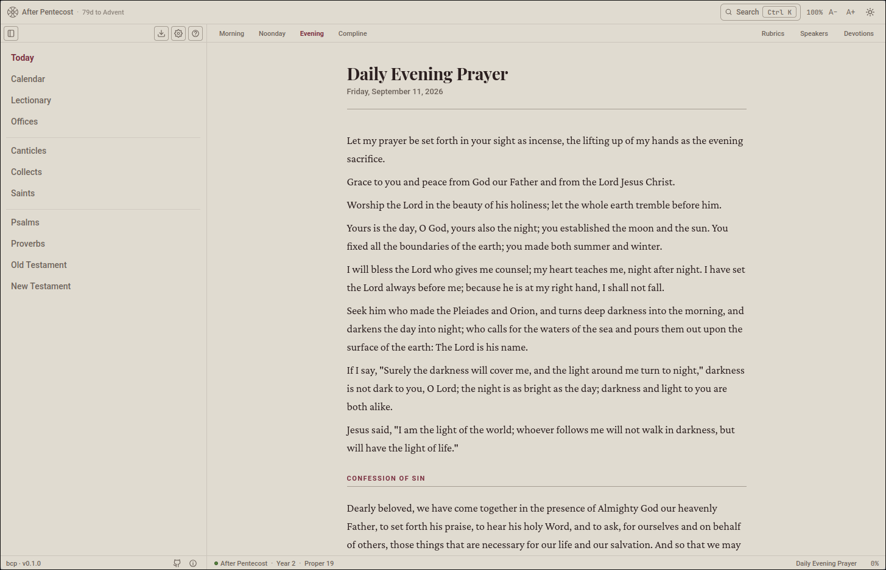

<p align="center">
  
</p>

<h1 align="center">bcp</h1>

<p align="center">
  The Book of Common Prayer (1979, The Episcopal Church) Daily Office.
  A lightweight, offline-capable reader that runs in the browser and as a
  Tauri desktop app.
</p>

<p align="center">
  Free, forever. All liturgical content is public domain.
</p>

<p align="center">
  
</p>

## Features

- Morning and Evening Prayer with the day's readings from the Daily Office lectionary
- Psalms and the psalter, canticles, collects, and KJV scripture
- Feasts, fasts, and sanctorale observances with commemorations
- Scripture search, per-lesson progress, and automatic scrolling
- Light and dark themes with a season-aware palette
- No distractions: static build, offline-capable, installable

## Support

bcp is free and always will be. If you'd like to say thanks, you can
[support it on Ko-fi](https://ko-fi.com/vittv)!

## Development

See [CONTRIBUTING.md](CONTRIBUTING.md) for building, testing, and contributing
changes.

## Installation

bcp is a desktop app for macOS, Windows, and Linux, a web app for Android and
iPhone, and an installable web app. Pick your platform below; each option
installs the newest version. Open the [latest release page](https://github.com/Vittv/bcp/releases/latest).

### Desktop

**Linux**

- [Rootless tarball](https://github.com/Vittv/bcp/releases/latest/download/bcp-linux-x86_64.tar.gz). Needs no root or AppImage; requires the system webview.

```sh
curl -LsS https://raw.githubusercontent.com/Vittv/bcp/main/scripts/install-linux.sh | bash
```

Adds the binary to your PATH, registers the app in the desktop menu (including its icon), and cleans up on uninstall.

> The native app renders with the system WebKitGTK. If fonts look wrong, use the Web app (PWA) option instead.

**Debian, Ubuntu, and Fedora:** `.deb` and `.rpm` packages for Debian, Ubuntu,
Fedora, and compatible distros are also on the [release page](https://github.com/Vittv/bcp/releases/latest).

**macOS**

- Universal disk image (Apple Silicon and Intel) from the [release page](https://github.com/Vittv/bcp/releases/latest). Drag the app into Applications.

**Windows**

- NSIS installer (.exe) or MSI from the [release page](https://github.com/Vittv/bcp/releases/latest). Uses the system WebView2, so no separate runtime download is needed.

> The installers aren't code-signed, so Windows SmartScreen will warn on first launch. Click More info, then Run anyway.

### Web app (PWA)

Works on any OS. bcp runs in any modern browser and installs into its own window with its own launcher icon.

1. Open [bcp](https://vittv.github.io/bcp/) in a Chromium-based browser.
2. Click the install icon at the right end of the address bar.
3. Confirm the install prompt.

> Firefox-based browsers can't install web apps; add the [firefoxpwa connector](https://github.com/filips123/PWAsForFirefox) first, then install bcp from the browser's menu.

### Mobile (PWA)

**Android**

1. Open [bcp](https://vittv.github.io/bcp/) in any browser.
2. Tap the Menu, then Install app or Add to Home Screen.

> On some older phones Firefox needs a small home-screen helper app first; it offers to install it when you try to install a web app.

**iPhone and iPad**

1. Open [bcp](https://vittv.github.io/bcp/) in Safari.
2. Tap Share, then Add to Home Screen.

> This works in Safari only. Chrome and Firefox on iOS are WebKit-based, so their Add to Home Screen is a bookmark, not an app.

### Updates

The desktop app checks the release page for a newer version. In Settings, choose Check for Updates to download and install the latest build, then relaunch. New releases appear there automatically.

The web app (Android and iPhone) never needs an update. It always runs the newest version, loading fresh content on every visit, so there is nothing to install.

## Platform notes

- The Expo web export is deployed to GitHub Pages at `/bcp` on every push to
  main by `deploy.yml`; `BASE_URL` configures the asset root per target.
- The desktop shell embeds the same web export in a Tauri webview.
- All app, browser, and platform icons are derived from a single 1024x1024
  flat master by `tools/icons/regenerate.mjs` (`bun icons`).

## License

bcp is free and always will be, with no ads, accounts, or paywall. All the
liturgical content is in the public domain; the app code itself is MIT.